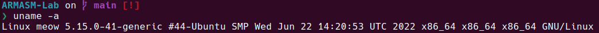
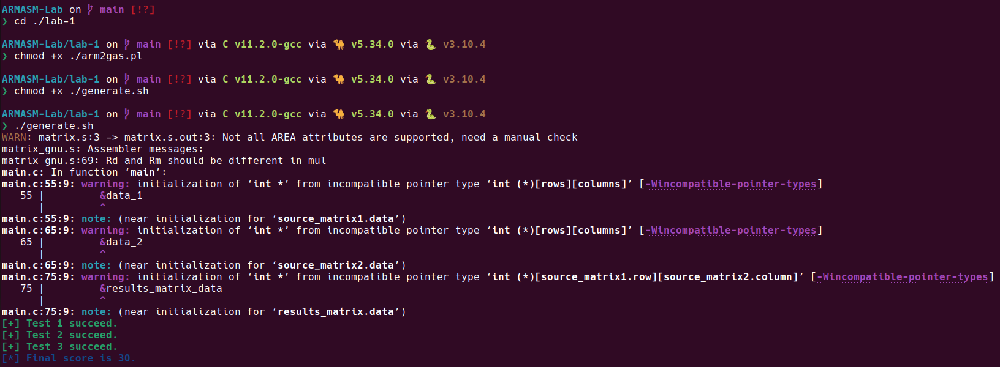

# ARMASM Lab

SJTU-NIS2331 Computer Composition and System Architecture course lab: ARM assembly implementation of matrix multiplication.

## Environment

All my programs are running in Ubuntu 22.04LTS. And I use zsh for my command line. If an error occurs at runtime, you should check the runtime environment or install the relevant dependency packages, etc. The required ones can be found in the [`./lab-1/generate.sh`](./lab-1/generate.sh) and [`./lab-2/generate.sh`](./lab-2/generate.sh).



## Lab-1

- Assignment: [`lab1`](lab-1/ARMASM-lab1.pdf).
- Solution file: [`matrix.s`](./lab-1/matrix.s).

### Usage

```zsh
$> cd ./lab-1
$> chmod +x ./arm2gas.pl
$> chmod +x ./generate.sh
$> ./generate.sh
```

### Output

```zsh
[+] Test 1 succeed.
[+] Test 2 succeed.
[+] Test 3 succeed.
[*] Final score is 30.
```



## Lab-2

- Assignment: [`lab2`](lab-2/ARMASM-lab2.pdf).
- Solution file: [`matrix_mul_asm`](./lab-2/matrix_mul_asm.s).

### Usage

```zsh
$> cd ./lab-2
$> chmod +x ./generate.sh
$> ./generate.sh
```

### Output

```zsh
# just an example

```

## References

- [ARM Assembly Basics](https://azeria-labs.com/writing-arm-assembly-part-1/)
- [RUNNING ARM BINARIES ON X86 WITH QEMU-USER](https://azeria-labs.com/arm-on-x86-qemu-user/)
- [DEBUGGING WITH GDB](https://azeria-labs.com/debugging-with-gdb-introduction/)
- [How to set up an ARM64 playground on Ubuntu 18.04](https://offlinemark.com/2020/06/24/how-to-set-up-an-arm64-playground-on-ubuntu-18-04/)